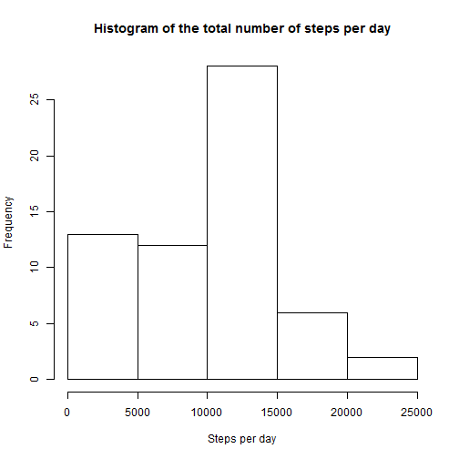
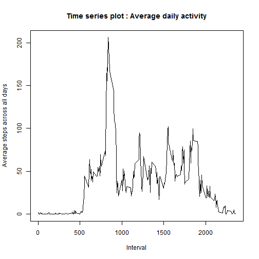
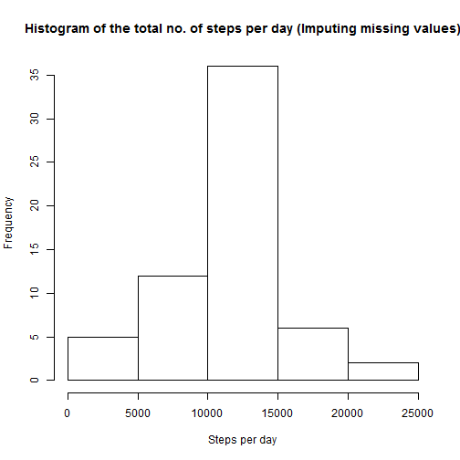
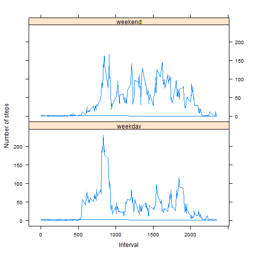

## Loading and preprocessing the data

```r
library(data.table)
library(lattice)
dt <- read.table("activity.csv",header = TRUE,colClasses=c("numeric","character","numeric"), sep=",")
```


## What is mean total number of steps taken per day?


```r
#compute number of steps per day
stepsPerDay <- tapply(dt$steps,as.factor(dt$date),sum, na.rm = TRUE)

#compute mean of number of steps per day
stepsPerDay_mean <- mean(stepsPerDay,na.rm=TRUE)

#compute median of number of steps per day
stepsPerDay_median <- median(stepsPerDay,na.rm=TRUE)

#Plot histogram of total number of steps per day
hist(stepsPerDay, main = "Histogram of the total number of steps per day", xlab = "Steps per day")
```

 

##### Mean of the total number of steps taken per day : 9354.2295082

##### Median of the total number of steps taken per day : 10395


## What is the average daily activity pattern?

```r
stepsPerInterval_mean <- tapply(dt$steps,as.factor(dt$interval),mean, na.rm=TRUE)

plot(names(stepsPerInterval_mean), stepsPerInterval_mean, type = "l", 
     xlab = "Interval", ylab = "Average steps across all days",
     main = "Time series plot : Average daily activity")
```

 

```r
#Find 5-minute interval, that contains the maximum number of steps on average across all the days
maxStepInterval <- names(stepsPerInterval_mean)[which.max(stepsPerInterval_mean)]
```

##### 5-minute interval, that contains the maximum number of steps on average across all the days in the dataset : 835


## Imputing missing values
#### Strategy for imputing missing values : The missing values are being filled with the mean of steps across all days for the same 5 minute interval

```r
#compute number of rows with NAs (missing data)
noOfRowswithNAs <-nrow(dt[!complete.cases(dt),])
```

##### Total number of rows with NAs : 2304


```r
#Create a new dataset that is equal to the original dataset but with the missing data filled in.

dt <- data.table(dt)
meanStepsPerIntervalTbl <- data.table(interval = as.numeric(names(stepsPerInterval_mean)), 
                                  meanSteps = stepsPerInterval_mean)
#Fill NA values with mean of steps across all days for the same 5 minute interval
fdt <- dt[,newSteps:=as.numeric(ifelse(is.na(dt$steps), 
                      meanStepsPerIntervalTbl[dt$interval,meanStepsPerIntervalTbl$meanSteps],
                      dt$steps))]

#Calculate and report the mean and median total number of steps taken per day. 
stepsPerDay_i <- tapply(fdt$newSteps,as.factor(fdt$date),sum)
stepsPerDay_mean_i <- mean(stepsPerDay_i)
stepsPerDay_median_i <- median(stepsPerDay_i)

#Make a histogram of the total number of steps taken each day
hist(stepsPerDay_i, 
     main = "Histogram of the total no. of steps per day (Imputing missing values)", 
     xlab = "Steps per day")
```

 

#### After imputing missing values :

##### Mean of the total number of steps taken per day : 1.0766189 &times; 10<sup>4</sup>

##### Median of the total number of steps taken per day : 10766

##### Mean and Median of total number of steps after imputing missing values differs. It increases the Mean and Median of number of steps taken per day as the missing data has been replaced with the average steps in each 5 minute interval across all days.

## Are there differences in activity patterns between weekdays and weekends?

```r
#Create a new factor variable in the dataset with two levels - "weekday" and "weekend"
#indicating whether a given date is a weekday or weekend day.
fdt <- fdt[,dayType:= as.factor(ifelse(weekdays(fdt$date) %in% c("Sat", "Sun"),"weekend", "weekday"))]

#Compute average steps across weeks averaged across all weekday days or weekend days
fdt <- fdt[,grpkey:= paste(fdt$dayType,as.character(fdt$interval))]
fdt <- fdt[,avSteps:= mean(newSteps), by= grpkey ]

#Make a panel plot containing a time series plot (i.e. type = "l") of the 5-minute interval (x-axis) and the
#average number of steps taken, averaged across all weekday days or weekend days (y-axis).
p <- xyplot(fdt$avSteps ~ fdt$interval  | as.factor(fdt$dayType), layout = c(1,2),
            xlab= "Interval", ylab = "Number of steps", type = 'l')

#print the panel plot
print(p)
```

 
